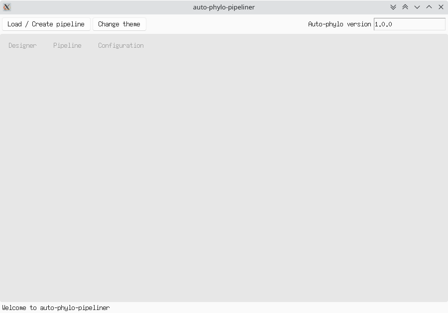
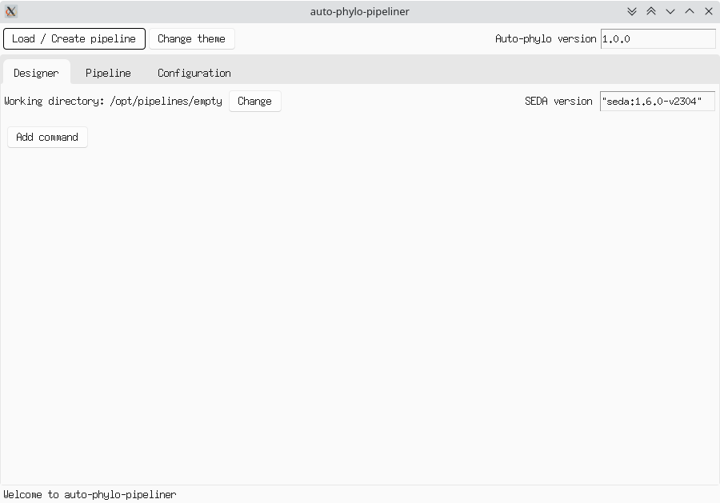
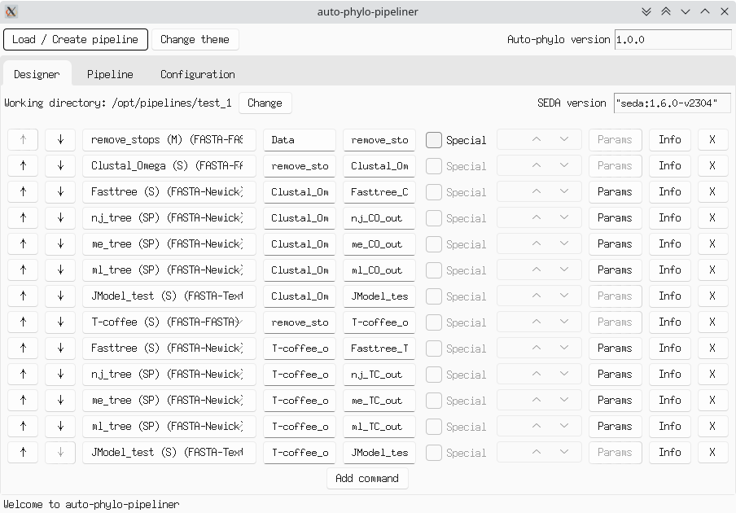
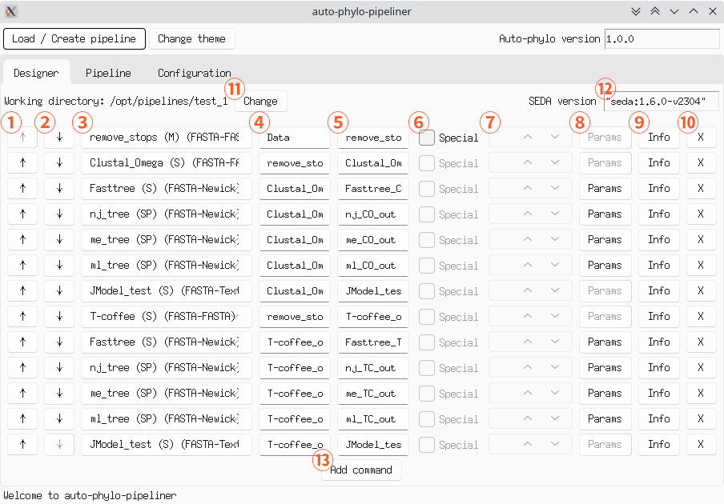
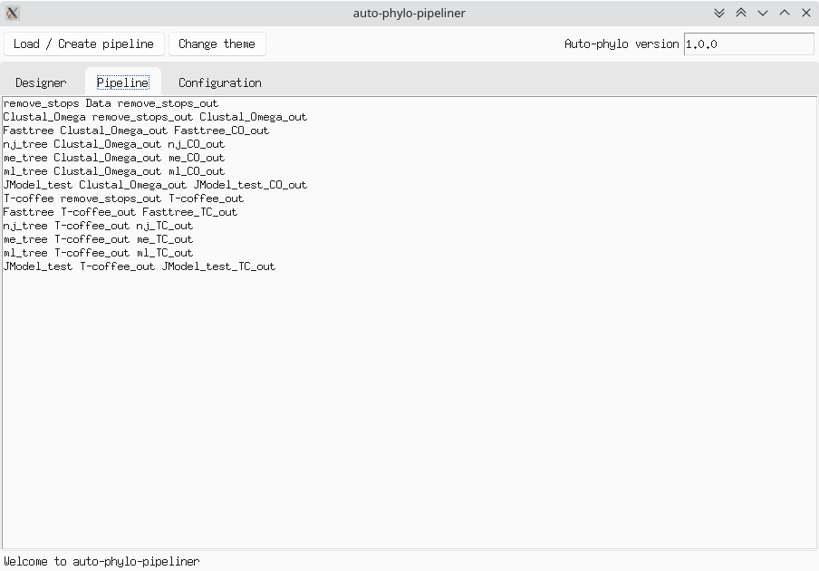
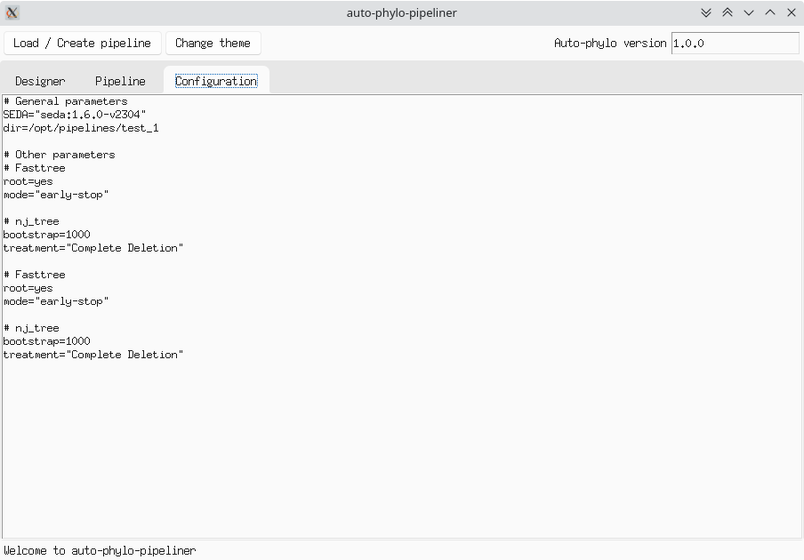

Pipeliner (GUI)
***************

For more comfortable creation of **auto-phylo** pipelines we have developed **auto-phylo-pipeliner**, a graphical interface that allows you to create or edit your pipelines without having to write a single line of code.

Installation
------------

pip
~~~

You can easily install **auto-phylo-pipeliner** by just executing:

.. code-block:: shell-session

   sudo apt-get install python3-tk && pip install auto-phylo-pipeliner

After the installation, you will have the command ``auto-phylo-pipeliner`` available, which will run the application and show the following window.

   Initial state of auto-phylo-pipeliner

.. warning::
   If the ``auto-phylo-pipeliner`` command is not available after the installation you will have to close and open again your session.

.. note::
   The command ``pip install auto-phylo-pipeliner`` installs **auto-phylo-pipeliner** only for the current user.
   
   If you want to install **auto-phylo-pipeliner** for all the users, you can run the installation command as root (i.e. ``sudo pip install auto-phylo-pipeliner``). However, executing ``pip`` as root may imply some security risks.

Docker
~~~~~~

Alternatively, you can use the ``pegi3s/auto-phylo-pipeliner`` Docker image to run it. To do so, invoke the following command: 

.. code-block:: docker
   
   docker run --rm -ti \
      -e DISPLAY=$DISPLAY \
      -v /tmp/.X11-unix:/tmp/.X11-unix \
      -v $HOME/.Xauthority:/root/.Xauthority \
      -v "${PWD}":"${PWD}" -w "${PWD}" \
         pegi3s/auto-phylo-pipeliner

Note that the current working directory (i.e. the directory from where you run the command) will be mounted and used as working directory in the new container.

If the above command fails, try running ``xhost +`` first.

Loading / Creating a pipeline
-----------------------------

The first step to create or edit your pipeline is to create a new one or load an existing one. To do this, you have to use the ``Load / Create pipeline`` button that will show a dialog to select a directory. In case it is empty, a new pipeline will be created, as in the following figure.

   Example of an empty pipeline

However, if the selected directory contains any pipeline file (i.e. ``pipeline``, ``config``, or ``run.sh``), ``auto-phylo-pipeliner`` will ask you whether you want to load it or overwrite it. If you decide to **overwrite**, a new empty pipeline will be created (**be careful, you may lose important information!!**). On the other hand, if you choose to load then the existing pipeline will be loaded.

   Example of a pipeline with several commands configured

.. note::
   During the loading process the files will be parsed to confirm that they are valid, warning you of any errors that may exist in them, as can be seen in the following figure.

   .. figure:: images/pipeliner/loading_error.png
      :align: center
      :width: 500px

      Error message shown when trying to load an invalid pipeline

Editing a pipeline
------------------

In the pipeline editing view (see figure below) a form will be shown in a row for each command that is part of the pipeline. The options offered by these forms are:

1. Move the command to a previous position.
2. Move the command to a later position.
3. Change the command (Important, this will cause the configured parameters to be lost).
4. Set the input directory (relative to the working directory).
5. Set the output directory (relative to the working directory).
6. Activate the "Special" option (only if supported by the command).
7. If the "Special" option is enabled, set its value.
8. Set the command parameters (only if it has parameters). A dialog will be displayed in which the value of the parameters can be set.
9. Access the reference documentation to view information about the command.
10. Delete the command from the pipeline.

   Main components of the editing view

In addition, in this view you can:

11. Change the working directory.
12. Modify the SEDA version used in the pipeline.
13. Add a new command.

Viewing the pipeline
--------------------
While editing a pipeline, auto-phylo-pipeliner will update the pipeline files (i.e. ``pipeline``, ``config``, or ``run.sh``) in the working directory. In the ``Pipeline`` and ``Configuration`` tabs you can view the contents of the pipeline and config files, respectively, at any time.

   An example of the pipeline view.

   An example of the config view.

.. note::
   Note that **auto-phylo-pipeliner** can only generate the pipeline files if your configuration is correct and complete. To do this, it will continuously validate your current pipeline configuration and show you in the status bar whether it is valid or not.

   .. figure:: images/pipeliner/pipeline_validation.png
      :align: center
      :width: 500px

      Validation messages shown in the status bar when the pipeline is changed

Running the pipeline
--------------------

As mentioned above, one of the pipeline files generated by auto-phylo-pipeliner is the ``run.sh`` file. This file contains a script that, invoked from the working directory, will launch the execution of the pipeline with auto-phylo through Docker (see :ref:`how-to-run`).

If you want to run your pipeline in a specific version of **auto-phylo**, you can modify the field (``Auto-phylo version``) in the upper right corner of the application.

Changing the theme
------------------

**auto-phylo-pipeliner** uses, by default, a light theme for the interface. However, if you wish, you can switch to use a dark theme using the ``Change theme`` button.