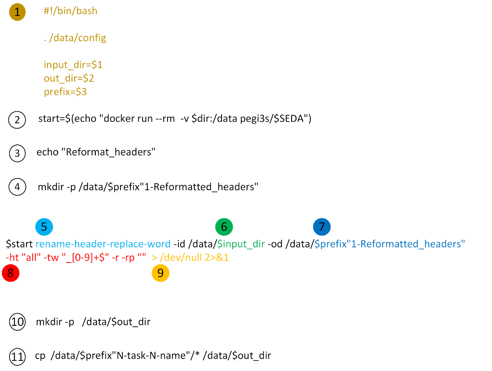

auto-phylo script basic structure
*********************************

This section presents the basic structure of an **auto-phylo** script.

The way FASTA files should be parsed to have the format desired by the user, depends on the source database, and the
user needs. Although, the module here provided for parsing CDS files downloaded from the NCBI Assembly database, 
likely accommodates most user needs, the structure of a basic auto-phylo script is relatively simple as the figure
below shows, and thus, even a researcher with very basic knowledge on bash scripting should be able to write a simple
module for parsing the FASTA files, using SEDA-CLI operations ([1]; https://hub.docker.com/r/pegi3s/seda/). Assuming 
that such module is named my_module and that it is located in the working directory (``/your/data/dir``), it can be
copied into the Docker image, and then be invoked as any other auto-phylo module, with the following command:

.. code-block:: docker

    docker run --rm \
        -v /your/data/dir:/data \
        -v /var/run/docker.sock:/var/run/docker.sock \
            pegi3s/auto-phylo bash -c "cp /data/my_module /opt && /opt/main"

The following figure shows the basic structure of an auto-phylo script.

Where:

1. Command lines required by all auto-phylo scripts.
2. Required if using SEDA-CLI operations ([1]; https://hub.docker.com/r/pegi3s/seda/).
3. Informative message.
4. Creates the directory where the result of the operation listed below will be saved. Do not forget to declare the ``$prefix`` variable.
5. The name of the SEDA-CLI operation being invoked must be declared after ``$start`` (in the example, the rename-header-replace-word operation).
6. The input directory of the first operation must be ``/data/$input_dir`` (the variable ``$input_dir`` captures the name of the input directory declared in the pipeline file).
7. The name of the output directory of the first operation, that should be, in case the pipeline is not branched, the input directory of the second operation.
8. The parameters of the specified operation. Variables defined in the config file can be used, by invoking ``$variable_name``.
9. Instruction to hide the output usually shown in the console.
10. Creates the output directory specified in the pipeline file.
11. Copies the relevant output to the output directory specified in the pipeline file (in this case by invoking the wildcard \*, we are assuming that all files are relevant).
